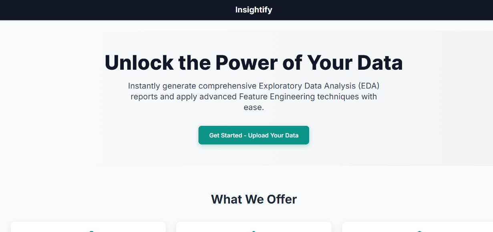
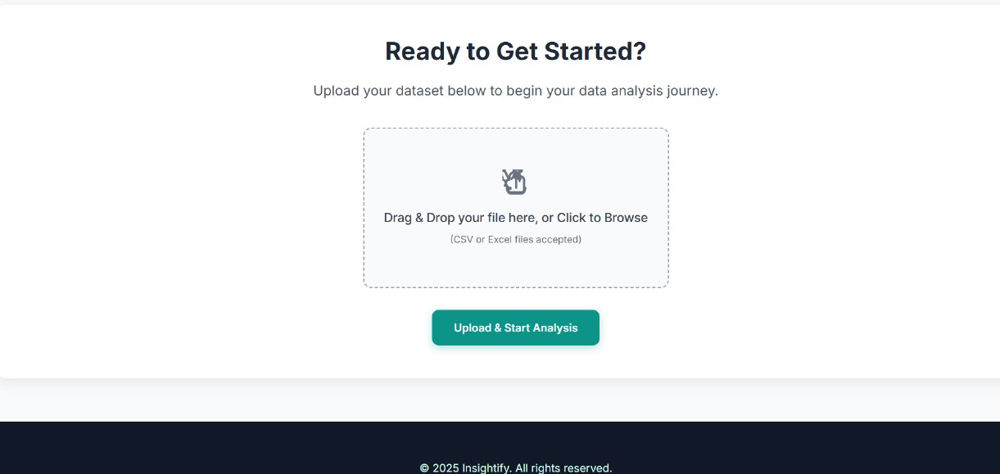
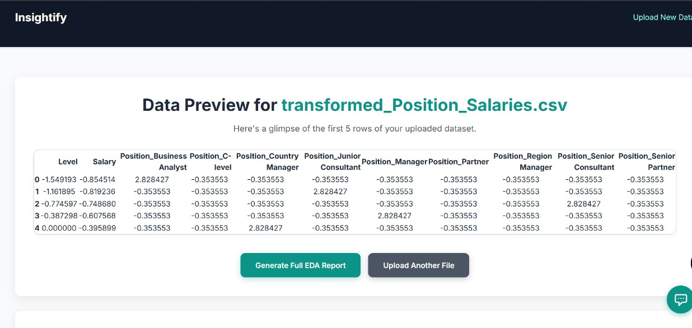
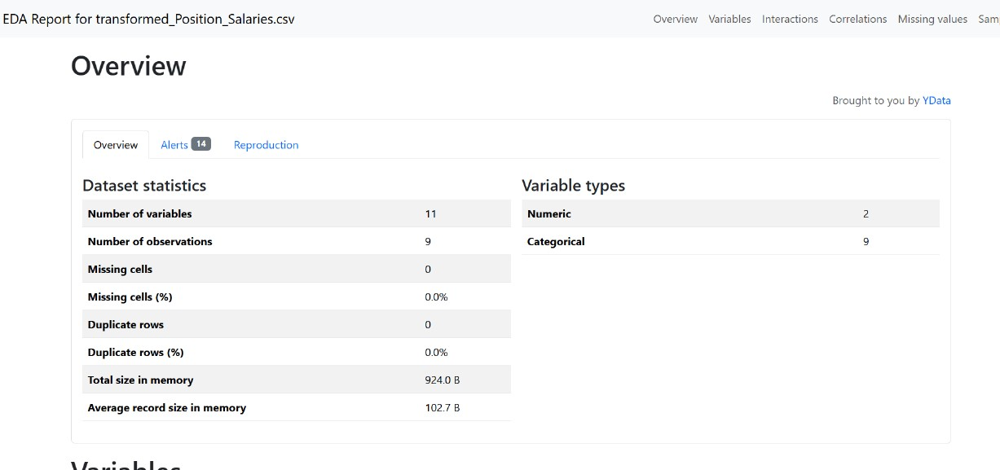
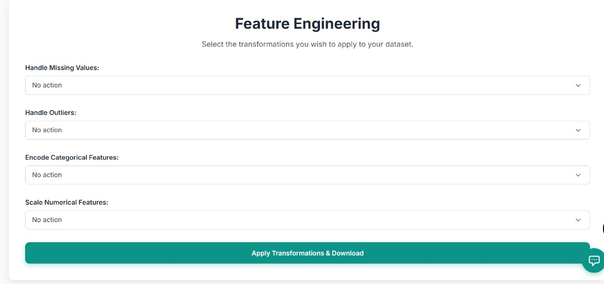
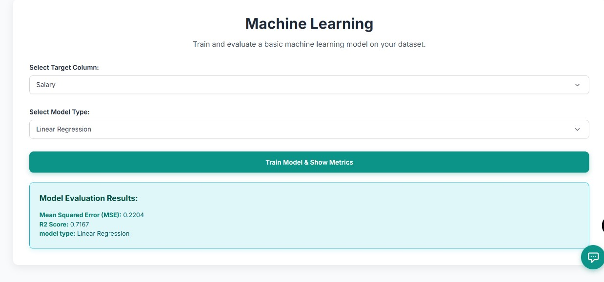
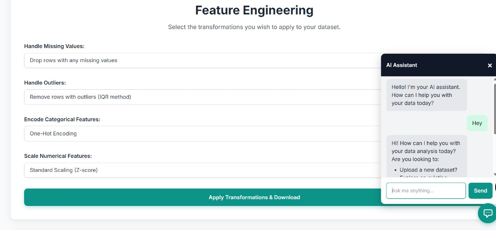

# Insightify
Insightify 📊✨
A comprehensive Flask web application for Exploratory Data Analysis (EDA), Feature Engineering, and basic Machine Learning model training.



# Table of Contents
1. Project Overview
2. Features
    - Automated Exploratory Data Analysis (EDA)
    - Powerful Feature Engineering
    - Basic Machine Learning Model Training
    - Intelligent AI Assistant
3. How to Run Locally
4. Future Enhancements
5. Technologies Used

# Project Overview
Insightify is designed to streamline the initial, often time-consuming, phases of a data science project. It provides a user-friendly interface to:
1. Upload CSV or Excel datasets.



2. Visualize data previews instantly.
3. Generate in-depth EDA reports to understand data characteristics.
4. Transform data using various feature engineering techniques (handling missing values, outliers, encoding categorical features, scaling numerical features).
5. Train and evaluate foundational machine learning models with customizable hyperparameters.
6. Receive guidance from an integrated AI assistant throughout the process.

This application is ideal for data enthusiasts, students, or anyone looking for a quick and intuitive way to prepare and analyze their datasets for machine learning tasks.

# Features
1. Automated Exploratory Data Analysis (EDA)
Generate rich, interactive HTML reports that provide deep insights into your dataset's structure, distributions, missing values, and correlations with a single click.





2. Powerful Feature Engineering
Prepare your data for machine learning models by applying essential transformations directly through the UI.
- Handle Missing Values: Choose strategies like dropping rows, or imputing with mean, median, or mode.
- Handle Outliers: Cap or remove outliers using the Interquartile Range (IQR) method.
- Encode Categorical Features: Convert text-based categories into numerical formats using One-Hot Encoding or Label Encoding.
- Scale Numerical Features: Normalize numerical data using Standard Scaling (Z-score) or Min-Max Scaling.



3. Basic Machine Learning Model Training
Train and evaluate common machine learning models on your prepared dataset.

Model Selection: Choose from:
- Regression: Linear Regression, Decision Tree Regressor, Random Forest Regressor, K-Nearest Neighbors Regressor.
- Classification: Decision Tree Classifier, Random Forest

Classifier, K-Nearest Neighbors Classifier.
- Target Column Selection: Dynamically populated dropdown with your dataset's columns.
- Hyperparameter Tuning: Adjust key hyperparameters (e.g., max_depth, n_estimators, n_neighbors) to optimize model performance.
- Evaluation Metrics: View relevant metrics (e.g., MSE, R2 Score for regression; Accuracy, Precision, Recall, F1 Score for classification).



4. Intelligent AI Assistant
Get instant help and explanations about Insightify's features, data analysis concepts, and machine learning guidance directly within the application.



# How to Run Locally
Follow these steps to set up and run Insightify on your local machine:
**1. Clone the Repository:**
```
git clone https://github.com/Mai3Prabhu/Insightify.git
cd Insightify
```
**2. Create and Activate a Virtual Environment:**

It's highly recommended to use a virtual environment to manage dependencies.

# Create virtual environment
```
python -m venv venv
```
# Activate virtual environment
On Windows (Command Prompt):
```
venv\Scripts\activate
```
# On Windows (PowerShell):
```
.\venv\Scripts\activate
```
# On macOS/Linux:
```
 source venv/bin/activate
```

3. Install Dependencies:
Install all required Python packages.
```
pip install -r requirements.txt
```
4. Obtain a Gemini API Key:

The AI Assistant feature requires a Gemini API key.

1. Go to Google AI Studio or the Google Cloud Console.
2. Create a new API key.
3. Important: 
Open app.py in your project and replace "YOUR_GEMINI_API_KEY" with your actual key:

In app.py
```
api_key = "YOUR_GEMINI_API_KEY"
```
5. Run the Flask Application:
```
python app.py
```
6. Access the Application:

Open your web browser and go to: http://127.0.0.1:5000/

# Future Enhancements
We plan to continue enhancing Insightify with more advanced features, including:
- Transformation History & Undo: Allow users to track and revert applied feature engineering steps.
- Custom Interactive Visualizations: Enable users to create custom plots (scatter, box, bar charts) based on selected columns.
- More Advanced ML Algorithms: Integrate additional algorithms like SVM, Gradient Boosting, etc.
- Model Persistence: Save and load trained models for future use.
- Deployment Guide: Provide instructions for deploying Insightify to cloud platforms like Google Cloud Run.

# Technologies Used
1. Backend: Flask (Python)
2. Data Manipulation: Pandas, NumPy
3. EDA: ydata-profiling
4. Machine Learning: Scikit-learn (Linear Regression, Decision Trees, Random Forest, K-Nearest Neighbors)
5. Frontend: HTML, Tailwind CSS, JavaScript
6. AI Assistant: Google Gemini API
7. Markdown Rendering: marked.js


